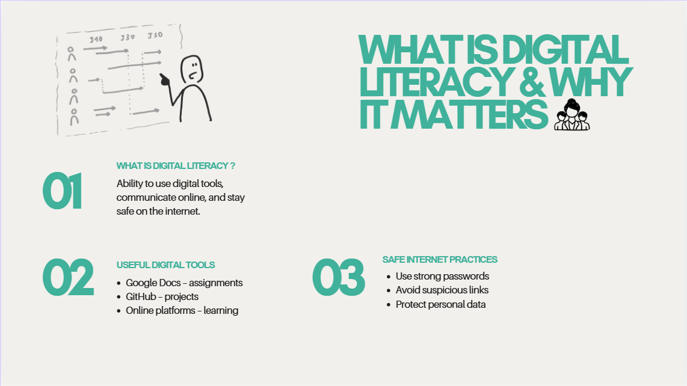

🎨 Task 1 – Notes / Reflection

In Task 1, I created a digital literacy infographic using Canva. The main objective was to visually represent the concept of digital literacy and highlight its importance for students. The infographic included key topics such as the meaning of digital literacy, useful digital tools, and safe internet practices.

While designing the infographic, I focused on keeping the layout clean, using appropriate colors, and adding icons to make the content more engaging and easy to understand. This task helped me learn how to present information in a visual format instead of plain text, which makes it more attractive and effective for the audience.

One challenge I faced was managing the content within limited space without making the design look crowded. I had to carefully select important points and arrange them properly. This improved my ability to organize information clearly.

Below is the screenshot of my infographic:

🔹 Infographic Design

Through this task, I learned that visual communication plays an important role in digital literacy. A well-designed infographic can explain complex ideas in a simple and engaging way, making it easier for people to understand and remember the information.
