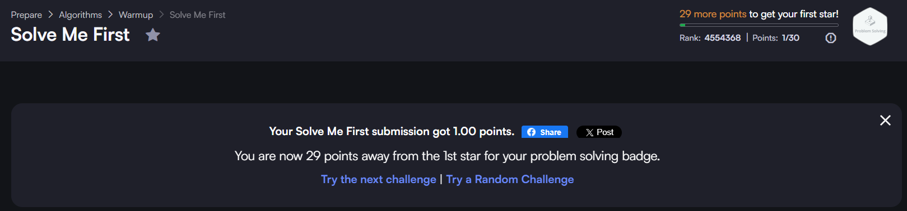
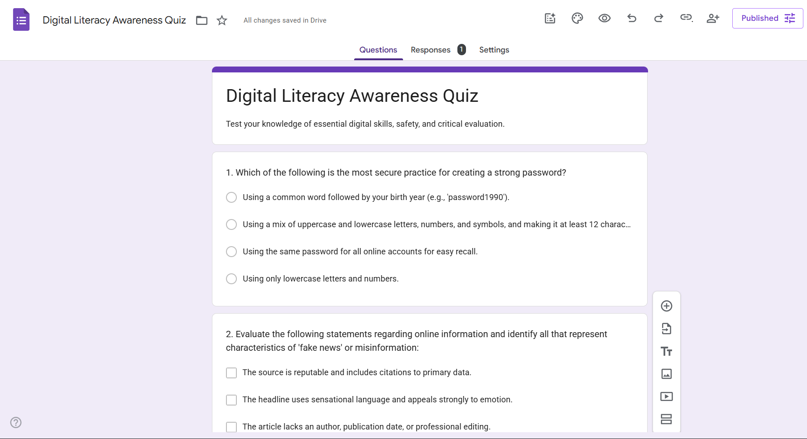
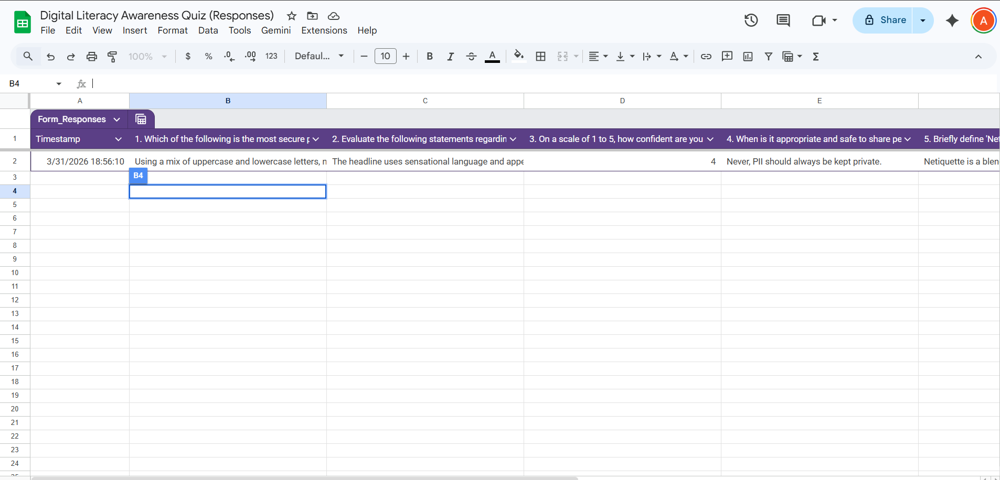

💻 Task 3 – Notes / Reflection

In Task 3, I explored both coding practice and online collaboration tools. For the coding part, I used HackerRank where I solved a beginner-level problem. This helped me understand basic programming logic and how to approach problems step by step. It also gave me confidence in using coding platforms and improved my problem-solving ability.

For the collaboration part, I created a quiz using Google Forms. The form included five questions related to digital literacy, such as online safety and useful tools. I also checked the responses using the linked Google Sheet, which helped me understand how data can be collected and analyzed easily.

Here is the link to my Google Form:
👉 https://docs.google.com/forms/d/e/1FAIpQLSfqScuRxBl1V8RV_maq2-_zzvntaSNp5QVtUahhN1zlT-v3Mw/viewform?usp=publish-editor

Below are the screenshots of my work:

🔹 HackerRank Solution

🔹 Google Form

🔹 Responses Sheet

Through this task, I learned that digital tools are not only useful for learning but also for collaboration and data collection. Coding platforms help in building logical thinking, while tools like Google Forms are useful for surveys and academic work. This task improved both my technical and practical understanding of digital platforms.
